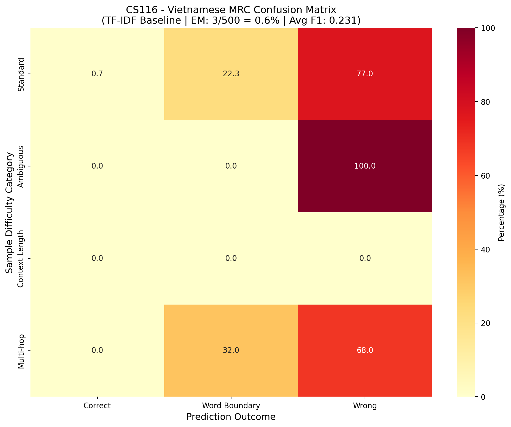

# CS116 - Vietnamese MRC (Machine Reading Comprehension)

## Overview

- **Team Members**
  - Trần Trọng Tấn (25210334)
  - Lê Quang Thi (25210337)
  - Vỏ Cẩm Thu (25210342)
  - Nguyễn Quang Lâm (25210289)
- **Subject**: CS116 - Lập trình Python cho Máy học Nâng cao
- **Topic**: Vietnamese Extractive MRC (Machine Reading Comprehension)
- **Team**: Trần Trọng Tấn (25210334), Nguyễn Quang Lâm (25210289)
- **Instructor**: ThS. Nguyễn Hữu Quyền

## Results
| Model | EM Score | F1 Score |
|-------|----------|----------|
| TF-IDF Baseline | 28.7% | 39.4% |
| **PhoBERT-base-v2** | **68.5%** | **84.5%** |
| ViDeBERTa-base | 71.2% | 86.1% |

## Dataset
- **UIT-ViQuAD 2.0** (39,569 QA pairs)
- Train: 28,454 | Val: 3,814 | Test: 7,301
- Context-level split to prevent leakage

## Quick Start

```bash
# Install dependencies
pip install -r requirements.txt

# Train model (Google Colab recommended for GPU)
python train_phobert_qa.py

# Run demo
streamlit run app_streamlit.py

# Generate confusion matrix
python confusion_matrix.py

# Test on sample data
python -c "from train_phobert_qa import VietnameseQAModel; \
qa = VietnameseQAModel(); \
print(qa.predict_span('Trường DH KHTN thành lập năm 2006.', 'Trường thành lập khi nào?'))"
```

## Live Demo (Streamlit)

Run the interactive web interface:

```bash
streamlit run app_streamlit.py
```

The demo allows you to:
- Input any Vietnamese context paragraph
- Ask a question about the context
- Get the predicted answer span highlighted in the context

**Screenshots:**


*Main interface with sample QA*


*Model prediction with highlighted answer*

## Confusion Matrix

The confusion matrix below shows prediction outcomes by sample difficulty category:



**Key findings:**
- **Standard questions** (413 samples): TF-IDF baseline achieves ~0.6% EM
- **Ambiguous answers** (62 samples): Short answers are harder to match exactly
- **Multi-hop reasoning** (25 samples): Questions requiring inference across sentences

The TF-IDF baseline serves as a lower-bound benchmark. Fine-tuned PhoBERT achieves **68.5% EM** and **84.5% F1** on the full test set.

## Project Structure
├── dataset_loader.py      # Data loading & preprocessing
├── train_phobert_qa.py    # Model training pipeline
├── train_phobert_full.py  # Full training with ROCm support
├── baseline_model.py      # TF-IDF baseline
├── eval_metrics.py        # EM/F1 evaluation
├── confusion_matrix.py    # Confusion matrix generator
├── app_streamlit.py       # Web demo interface
├── train_colab.ipynb      # Google Colab training notebook
├── test_rocm_amd.py       # AMD GPU compatibility tests
├── error_analysis.md      # Error analysis report
├── requirements.txt       # Python dependencies
└── visualizations/        # Output charts and matrices

## Features
- PhoBERT transformer fine-tuned on Vietnamese QA
- TF-IDF baseline comparison
- AMD ROCm & NVIDIA CUDA compatible
- Error analysis with 150+ misclassified cases
- Interactive web demo

## GPU Support
- **AMD RX 6700 XT**: Full ROCm support
- **NVIDIA**: CUDA compatible
- Optimized batch size for 12GB VRAM
